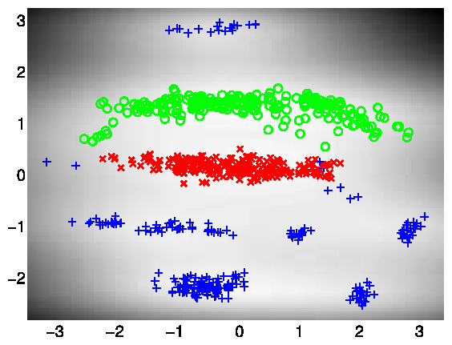
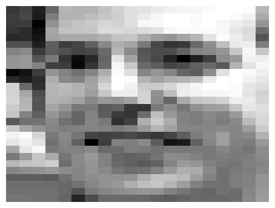
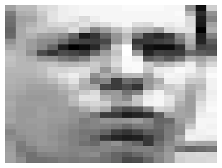
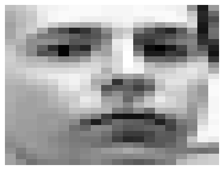
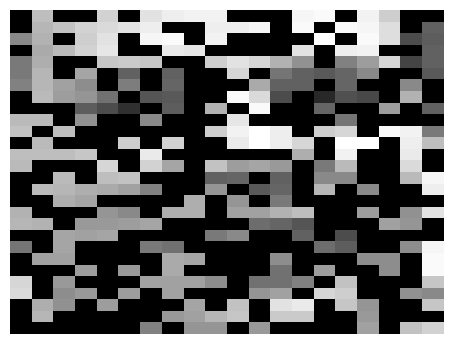
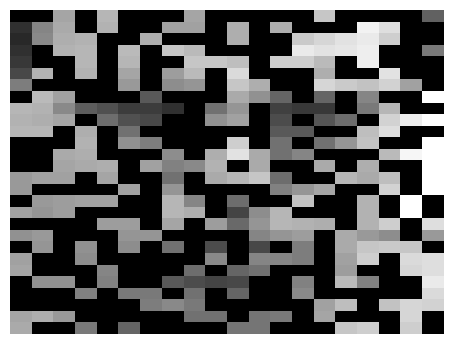
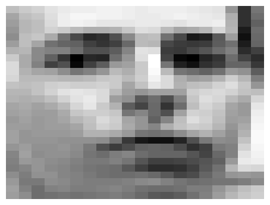
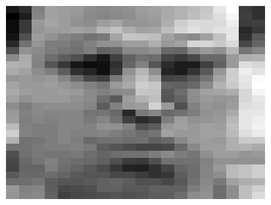
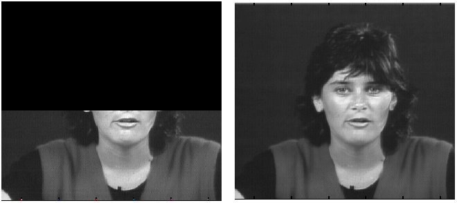
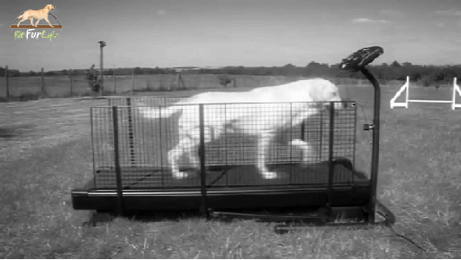

Bayesian GP-LVM model
=====================

This page describes examples of how to use the variational approximation to the Bayesian GP-LVM model.

The VARGPLVM software can be downloaded [here](http://www.cs.man.ac.uk/neill-bin/software/downloadForm.cgi?toolbox=vargplvm).

Release Information
-------------------

**Current release is 0.2**.

As well as downloading the VARGPLVM software you need to obtain the toolboxes specified below. **These can be downloaded using the *same* password you get from registering for the VARGPLVM software.**

|-----------------------------------------------------------------------------|-------------|
| **Toolbox**                                                                 | **Version** |
| [NETLAB](http://www.cs.man.ac.uk/~neill/netlab/downloadFiles/vrs3p3)        | 3.3         |
| [PRIOR](http://www.cs.man.ac.uk/~neill/prior/downloadFiles/vrs0p22)         | 0.22        |
| [OPTIMI](http://www.cs.man.ac.uk/~neill/optimi/downloadFiles/vrs0p132)      | 0.132       |
| [DATASETS](http://www.cs.man.ac.uk/~neill/datasets/downloadFiles/vrs0p1371) | 0.1371      |
| [MLTOOLS](http://www.cs.man.ac.uk/~neill/mltools/downloadFiles/vrs0p138)    | 0.138       |
| [KERN](http://www.cs.man.ac.uk/~neill/kern/downloadFiles/vrs0p227)          | 0.227       |
| [NDLUTIL](http://www.cs.man.ac.uk/~neill/ndlutil/downloadFiles/vrs0p162)    | 0.162       |
| [MOCAP](http://www.cs.man.ac.uk/~neill/mocap/downloadFiles/vrs0p136)        | 0.136       |
| [GP](http://www.cs.man.ac.uk/~neill/gp/downloadFiles/vrs0p137)              | 0.137       |
| [NOISE](http://www.cs.man.ac.uk/~neill/noise/downloadFiles/vrs0p141)        | 0.141       |

The released software now includes dynamical models.
#### Version 0.14

This release includes improved numerical stability on the gradient and bound computations which finds better solutions under the optimizer. Derived and implemented by Andreas Damianou and Michalis Titsias.

#### Version 0.1

This release is for the AISTATS 2010 submission.

Examples
--------

### Oil Data

The 'oil data' is commonly used as a bench mark for visualisation algorithms. For more details on the data see [this page](http://www.ncrg.aston.ac.uk/GTM/3PhaseData.html). In all of the following examples 50 inducing points were used.

#### Standard dataset

The script `demOilVargplvm1.m` runs the Bayesian GP-LVM Model on this dataset, giving the results shown on the left of the figure that follows. The visualization was achieved by keeping the most dominant latent dimensions (2 and 3) which have the largest inverse lengthscale value. Dimension 2 is plotted on the *y*-axis and 3 and on the *x*-axis. The script `demOilVargplvm2.m` is similar but there are missing outputs from test points; the model attempts to reconstruct these missing outputs. The result is shown on the right of the figure.

 *Left*: Bayesian GP-LVM on the oil data without missing outputs. The phases of flow are shown as green circles, blue crosses and red plusses. *Right*: Similar but in this case 50% of the outputs are missing and the model attempts to reconstruct them.
#### 100 points in the active set

The script `demOil100Vargplvm1.m` runs the Bayesian GP-LVM Model on the Oil Data with only 100 points in the active set, giving the result on the figure below.

 Bayesian GP-LVM on the oil data using 100 points in the active set.
### Loop Closure in Robotics

In on-going work with Dieter Fox and Brian Ferris at the University of Washington we are interested in loop closure for robotic navigation, included as an example is a data set of a robot completing a loop while reading wireless access point signal strengths. The script `demRobotWirelessVargplvm1.m` runs the Bayesian GP-LVM Model on this dataset in order to produce a neat track and close the loop, as can be seen on the figure shown below.

 Use of the Bayesian GP-LVM Model to obtain loop closure in a robot navigation example.
### Frey Faces Data

In this dataset, we try to exploit the ability of the model to reconstruct partially observed test data. Therefore, when the model is trained only half of the image pixels are assumed to be observed. After training on 1000 images, each partially observed test image was processed separately and the missing pixels were predicted as shown on the figures below. The code to obtain the following figures was based on the `demBrendanVargplvm3.m` script.

 Examples of reconstruction of partially observed test images in Frey faces by applying the Bayesian GP-LVM. Each column corresponds to a test image. In every column, the top panel shows the true test image, the middle panel the partially observed image (where missing pixels are shown in black) and the bottom image is the reconstructed image.
### Dynamical Systems Modelling

The Bayesian GPLVM model has been extended with dynamics in a fully Bayesian framework, where a temporal prior is placed on the latent space and the latent points are integrated out. This makes the model suitable for robust modelling of dynamical systems, such as motion capture data or video sequences. Given that the model is generative, the method can also be used to produce novel sequences. The script `demosDynamics.m` reproduces the corresponding experiments. The first diagram below demonstrates the ability of the method to reconstruct partially observed frames taken from a video sequence. The second diagram shows an image which is generated without giving partial information, apart from a time interval for inter- or extrapolation. The video used for that experiment expressed strong periodicity, which allowed the model to be trained on 60 frames and then produce a novel video sequence for any given time interval (in the particular experiment for times 61 to 100). The complete videos generated for these experiments can be found [here](http://staffwww.dcs.shef.ac.uk/people/A.Damianou/varFiles/paper/supplementary/).

 Reconstructing a partially observed frame.

 One of the frames that belong to a video sequence which is generated by the model.

`       `

Page updated on Tue Nov 22 00:39:27 2011
